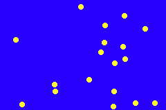

# Bouncers
Welcome to the Bouncer Game!
You can create a bouncer by pressing A, each bouncer spawns with a randomized speed. 

If a bouncer hits the walls, it... well, bounces! 

If you press B, then it will give you the average x-axis location for the bouncers!

You can add as many as you want! just as long as its not over 20.

Your game will look something like this! 

